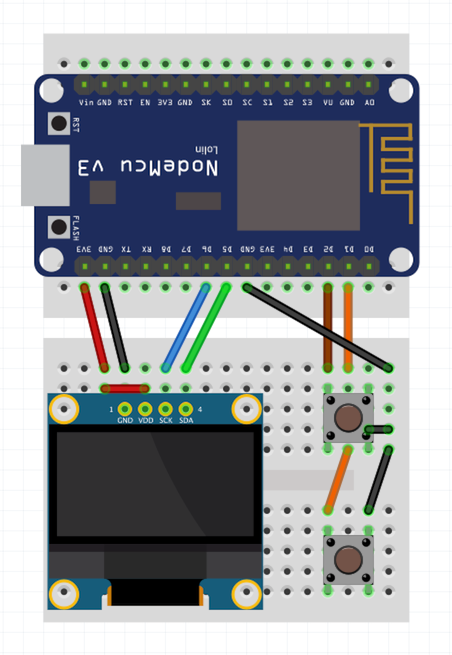

# Multiplayer pong game on the ESP8266

## Instructions

Clone the repository with submodules.

```
git clone --recurse-submodules git@github.com:hmil/espong.git
cd espong
```

### Building the firmware

Chose one of three options to build the firmware:

#### Option 1: Cloud build (for noobs)

Get your firmware online at [https://nodemcu-build.com/](https://nodemcu-build.com/).

Chose the following settings:

- Branch: master
- Modules: ADC, bit, file, GPIO, i2c, net, node, SJSON, timer, UART, U8G2, WiFi

#### Option 2: With docker (advanced mode)

To build and flash the firmware, you'll either need Docker or a have the tools to build a nodemcu firmware.

Connect your nodemcu and boot it in flash mode. Then run:

```
# Build in Docker:
make flash
```

#### Option 3: Native build (expert mode)

Connect your nodemcu and boot it in flash mode. Then run:

```
BUILD_FIRMWARE_IN_DOCKER=false make flash
```

### Upload the software

Reboot your chip and wait a minute for the initial setup to complete. Then upload the lua scripts.

To upload the lua files, run:

```
make upload
```

> ℹ️ The makefile remembers which files were uploaded to nodemcu and only uploads the files that have changed. If you connect a different nodemcu with the same serial port, then you'll want to clean the cache with
>
>     make clean
>

### Custom serial port

You can specify a custom serial port with the `PORT` environment variable.

For instance:
```
PORT=/dev/cu.usbmodem1234 make upload
```

## Wiring



NodeMCU pin | Connects to | Function
------------|-------------|----------
3v3         | oled vcc    | screen power
gnd         | oled gnd    | screen ground
D6          | oled scl    | iic clock
D5          | oled sda    | iic data
D2          | btn up      | Up / OK button
D3          | btn down    | Down button

